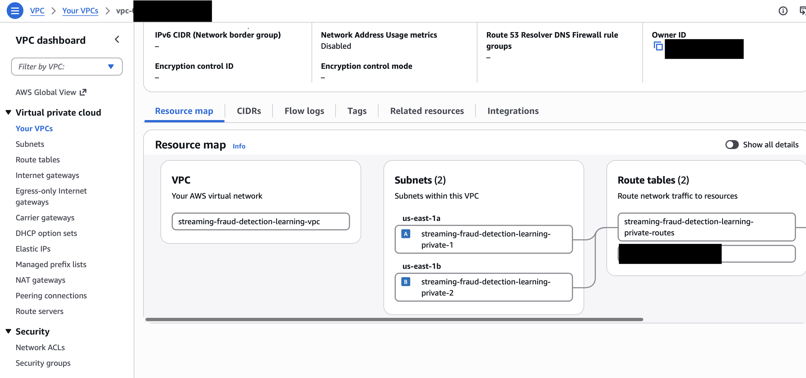
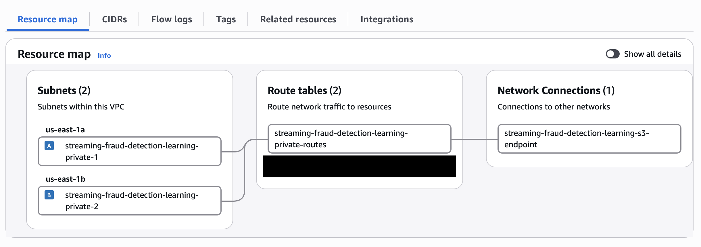
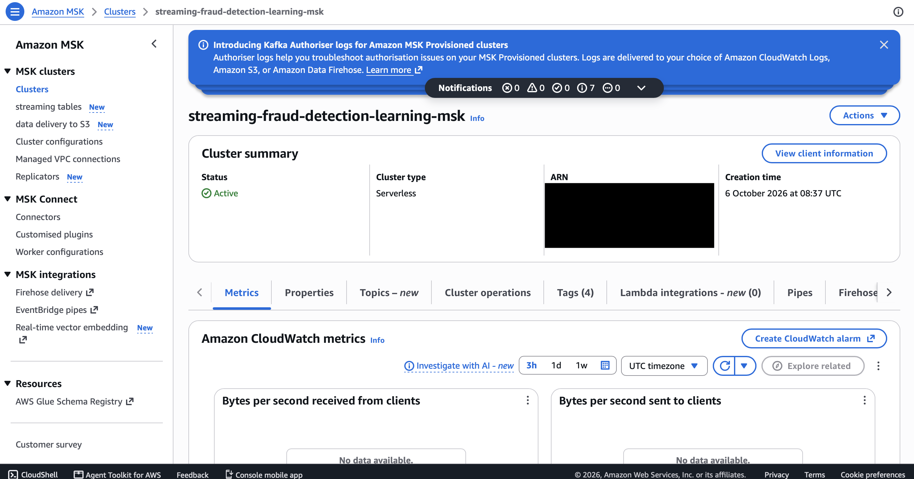
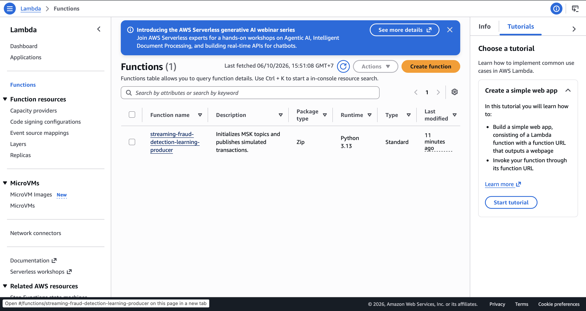
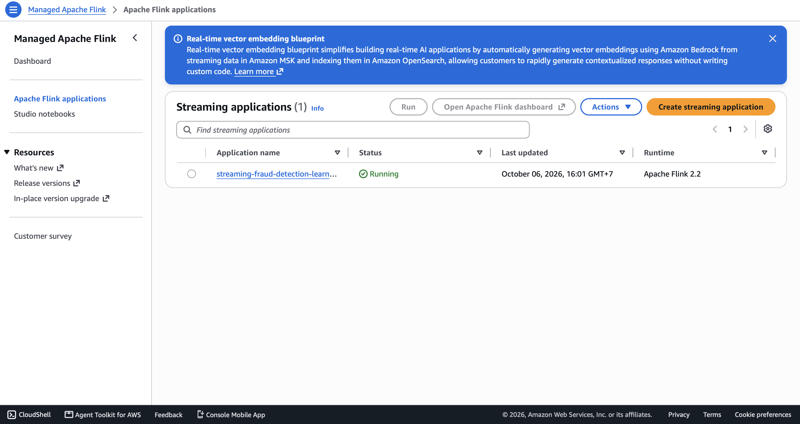
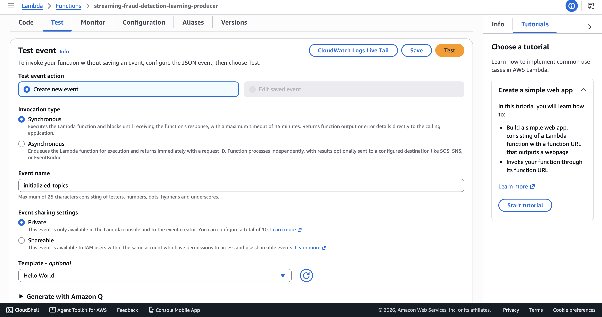
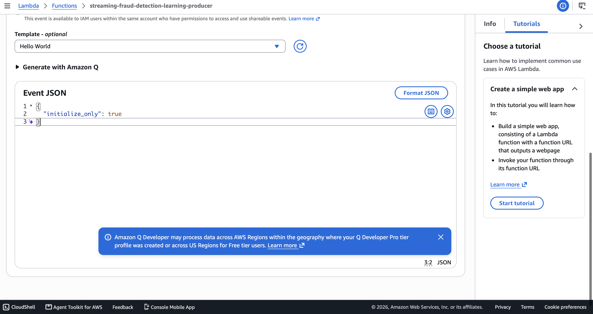
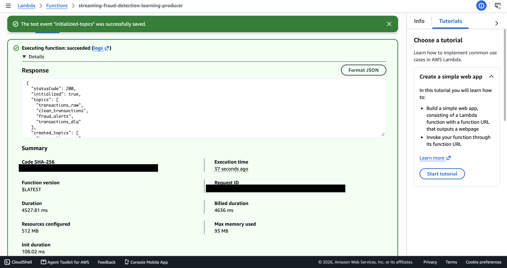
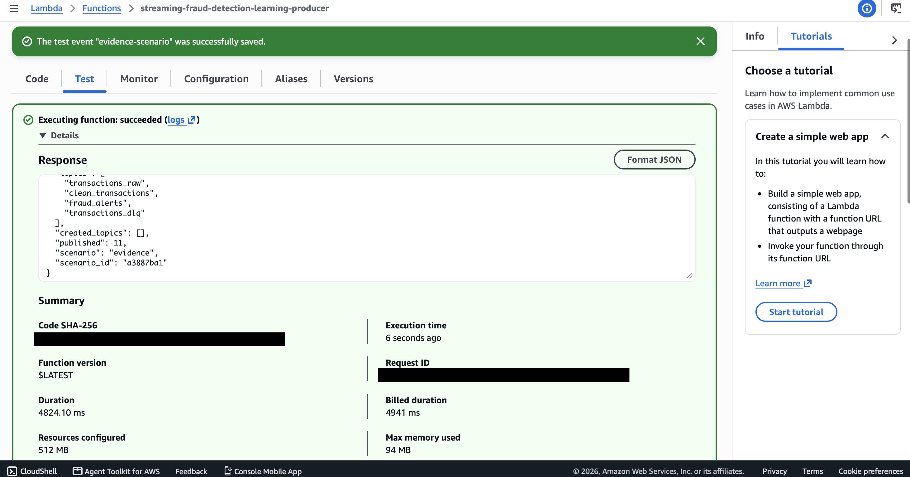
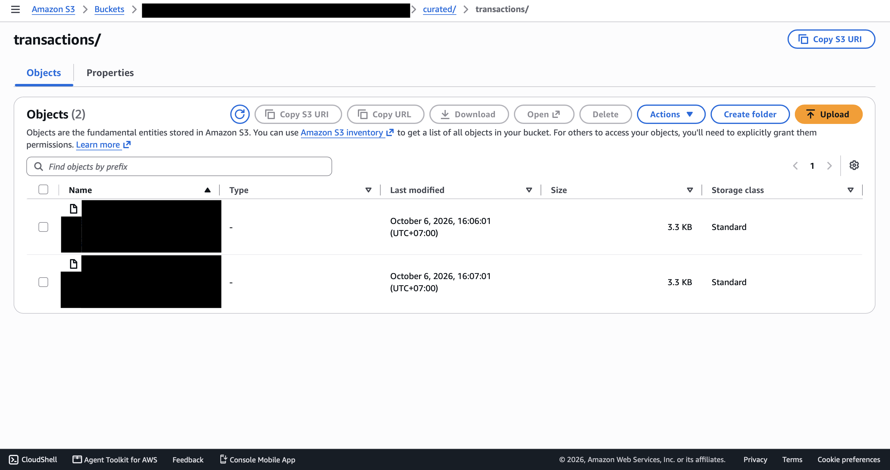

# streaming
1. Configure AWS authentication

### Prerequisites

Install the following tools:

- AWS CLI v2
- Python 3
- Java 17 and Maven
- Terraform 1.10 or later
- `unzip`

Confirm that the tools are available:

```bash
aws --version
python3 --version
java --version
mvn --version
terraform version
unzip -v
```

### Configure an AWS IAM Identity Center profile

Create the `streaming-learning` profile:

```bash
aws configure sso --profile streaming-learning
```

During configuration, provide your IAM Identity Center start URL and SSO region, select the appropriate AWS account and role, and use the following settings:

- Default client region: `us-east-1`
- Output format: `json`
- Profile name: `streaming-learning`

Sign in using the configured profile:

```bash
aws sso login --profile streaming-learning
```

Verify the active AWS account and role:

```bash
aws sts get-caller-identity --profile streaming-learning
```

Confirm that the returned account and role are the ones intended for this deployment.

For more information, see [Configuring IAM Identity Center authentication with the AWS CLI](https://docs.aws.amazon.com/cli/latest/userguide/cli-configure-sso.html).


2. Test the Python producer
```
cd producer
python3 -m unittest discover -p 'test_*.py'
```
Expected:
```
Ran 9 tests
OK
```
- Build the Lambda package:
```
./build_lambda_package.sh
```
Verify the ZIP:
```
unzip -t build/lambda-producer.zip
```
Expected output should end with:
```
No errors detected
```

Return to the project root:
```
cd ..
```
3. Test and build the Flink application
```
cd flink-app
mvn clean verify
```
Expected:
```
Tests run: 10, Failures: 0, Errors: 0
BUILD SUCCESS
```
The deployable JAR is created at:
```
flink-app/target/transaction-routing-job.jar
```
Return to the project root:
```
cd ..
```
4. Configure Terraform
```
cd infra/terraform
cp -n terraform.tfvars.example terraform.tfvars
```
Review terraform.tfvars:
```
aws_region   = "us-east-1"
aws_profile  = "streaming-learning"
project_name = "streaming-fraud-detection"
environment  = "learning"
```

Create Flink in READY state without starting paid runtime capacity.
```
flink_start_application = false
```
Do not commit terraform.tfvars, Terraform state files, or saved plan files.
Initialize and validate:
```
terraform init
terraform fmt -check
terraform validate
```
Create a deployment plan:
```
terraform plan -out=deploy.tfplan
terraform show deploy.tfplan
```
Confirm that:
- Resources are being added, not unexpectedly destroyed.
- Flink has start_application = false.
- The runtime is FLINK-2_2.
- The AWS region is us-east-1.

5. Deploy the base infrastructure
```
terraform apply deploy.tfplan
```
Terraform creates:
- One VPC
- Two private subnets
- An S3 gateway endpoint
- Security groups
- MSK Serverless
- A Lambda producer
- A stopped Managed Flink application
- Artifact and data S3 buckets
- CloudWatch log groups
- IAM roles and policies

6. Explore the infrastructure in the AWS Console
Set the Console region to US East (N. Virginia).

### VPC
Open:
VPC → Your VPCs → streaming-fraud-detection-learning-vpc
Inspect the resource map, private subnets, route table, S3 endpoint, and security groups.


###
Amazon MSK
Open:
Amazon MSK → Clusters → streaming-fraud-detection-learning-msk
Confirm:
- Status: ACTIVE
- Type: Serverless
- Authentication: IAM
- Networking uses the private subnets


###
Lambda
Open:
Lambda → Functions → streaming-fraud-detection-learning-producer
Inspect its runtime, VPC configuration, execution role, environment variables, and monitoring.

###
Managed Flink
Open:
Managed Service for Apache Flink
→ Applications
→ streaming-fraud-detection-learning-flink
Confirm that the application is initially READY.


7. Initialize the Kafka topics
The Lambda function creates the required topics from inside the VPC.
In the Lambda Console, open Test and create an event named initialize-topics:
```js
{
  "initialize_only": true
}
```


Expected response:
```js
{
  "statusCode": 200,
  "initialized": true,
  "topics": [
    "transactions_raw",
    "clean_transactions",
    "fraud_alerts",
    "transactions_dlq"
  ],
  "published": 0
}
```



Do not start Flink until this succeeds.

8. Start Flink
Change terraform.tfvars:
```bash
flink_start_application = true
```
Create and apply a new plan:
```bash
terraform plan -out=start-flink.tfplan
terraform show start-flink.tfplan
terraform apply start-flink.tfplan
```
The plan should normally update one resource without creating or destroying infrastructure.

9. Run the evidence scenario
In the Lambda Console, create a test event named evidence-scenario:
```json
{
  "scenario": "evidence"
}
```
Expected response:
```json
{
  "statusCode": 200,
  "initialized": true,
  "published": 11,
  "scenario": "evidence",
  "scenario_id": "example123"
}
```



The 11 transactions include:
- Five normal baseline transactions
- Five suspicious transactions
- One invalid transaction with a negative amount
Flink performs validation and fraud scoring. Lambda only generates and publishes the input records.

10. Inspect the processed Kafka output
Wait approximately one minute, then create a Lambda test event named inspect-results:
```json
{
  "inspect_only": true,
  "sample_limit": 10
}
```
The result should look like this:
```json
{
  "statusCode": 200,
  "initialized": true,
  "topics": [
    "transactions_raw",
    "clean_transactions",
    "fraud_alerts",
    "transactions_dlq"
  ],
  "samples": {
    "clean_transactions": [
      {
        "transaction_id": "evidence_example_clean_1",
        "user_id": "evidence_user_example",
        "amount": 100,
        "country": "TH",
        "event_time": "2026-10-06T08:45:00.274Z",
        "velocity_score": 0,
        "amount_anomaly_score": 0,
        "spending_burst_score": 0,
        "country_switch_score": 0,
        "risk_score": 0,
        "risk_level": "LOW",
        "risk_reasons": []
      },
      {
        "transaction_id": "evidence_example_clean_2",
        "user_id": "evidence_user_example",
        "amount": 100,
        "country": "TH",
        "event_time": "2026-10-06T08:49:00.274Z",
        "velocity_score": 0,
        "amount_anomaly_score": 0,
        "spending_burst_score": 0,
        "country_switch_score": 0,
        "risk_score": 0,
        "risk_level": "LOW",
        "risk_reasons": []
      },
      {
        "transaction_id": "evidence_example_clean_3",
        "user_id": "evidence_user_example",
        "amount": 100,
        "country": "TH",
        "event_time": "2026-10-06T08:53:00.274Z",
        "velocity_score": 0,
        "amount_anomaly_score": 0,
        "spending_burst_score": 0,
        "country_switch_score": 0,
        "risk_score": 0,
        "risk_level": "LOW",
        "risk_reasons": []
      },
      {
        "transaction_id": "evidence_example_clean_4",
        "user_id": "evidence_user_example",
        "amount": 100,
        "country": "TH",
        "event_time": "2026-10-06T08:57:00.274Z",
        "velocity_score": 0,
        "amount_anomaly_score": 0,
        "spending_burst_score": 0,
        "country_switch_score": 0,
        "risk_score": 0,
        "risk_level": "LOW",
        "risk_reasons": []
      },
      {
        "transaction_id": "evidence_example_clean_5",
        "user_id": "evidence_user_example",
        "amount": 100,
        "country": "TH",
        "event_time": "2026-10-06T09:01:00.274Z",
        "velocity_score": 0,
        "amount_anomaly_score": 0,
        "spending_burst_score": 0,
        "country_switch_score": 0,
        "risk_score": 0,
        "risk_level": "LOW",
        "risk_reasons": []
      }
    ],
    "fraud_alerts": [
      {
        "transaction_id": "evidence_example_fraud_1",
        "user_id": "evidence_user_example",
        "amount": 1000,
        "country": "SG",
        "event_time": "2026-10-06T09:04:10.274Z",
        "velocity_score": 0,
        "amount_anomaly_score": 40,
        "spending_burst_score": 30,
        "country_switch_score": 30,
        "risk_score": 100,
        "risk_level": "HIGH",
        "risk_reasons": [
          "AMOUNT_ANOMALY",
          "SPENDING_BURST",
          "COUNTRY_SWITCHING"
        ]
      },
      {
        "transaction_id": "evidence_example_fraud_2",
        "user_id": "evidence_user_example",
        "amount": 1200,
        "country": "US",
        "event_time": "2026-10-06T09:04:20.274Z",
        "velocity_score": 0,
        "amount_anomaly_score": 40,
        "spending_burst_score": 45,
        "country_switch_score": 60,
        "risk_score": 145,
        "risk_level": "HIGH",
        "risk_reasons": [
          "AMOUNT_ANOMALY",
          "SPENDING_BURST",
          "COUNTRY_SWITCHING"
        ]
      },
      {
        "transaction_id": "evidence_example_fraud_3",
        "user_id": "evidence_user_example",
        "amount": 1500,
        "country": "JP",
        "event_time": "2026-10-06T09:04:30.274Z",
        "velocity_score": 15,
        "amount_anomaly_score": 40,
        "spending_burst_score": 45,
        "country_switch_score": 60,
        "risk_score": 160,
        "risk_level": "HIGH",
        "risk_reasons": [
          "TRANSACTION_VELOCITY",
          "AMOUNT_ANOMALY",
          "SPENDING_BURST",
          "COUNTRY_SWITCHING"
        ]
      },
      {
        "transaction_id": "evidence_example_fraud_4",
        "user_id": "evidence_user_example",
        "amount": 1800,
        "country": "SG",
        "event_time": "2026-10-06T09:04:40.274Z",
        "velocity_score": 15,
        "amount_anomaly_score": 40,
        "spending_burst_score": 60,
        "country_switch_score": 60,
        "risk_score": 175,
        "risk_level": "HIGH",
        "risk_reasons": [
          "TRANSACTION_VELOCITY",
          "AMOUNT_ANOMALY",
          "SPENDING_BURST",
          "COUNTRY_SWITCHING"
        ]
      },
      {
        "transaction_id": "evidence_example_fraud_5",
        "user_id": "evidence_user_example",
        "amount": 2200,
        "country": "US",
        "event_time": "2026-10-06T09:04:50.274Z",
        "velocity_score": 15,
        "amount_anomaly_score": 50,
        "spending_burst_score": 60,
        "country_switch_score": 60,
        "risk_score": 185,
        "risk_level": "HIGH",
        "risk_reasons": [
          "TRANSACTION_VELOCITY",
          "AMOUNT_ANOMALY",
          "SPENDING_BURST",
          "COUNTRY_SWITCHING"
        ]
      }
    ],
    "transactions_dlq": [
      {
        "transaction_id": "evidence_example_invalid_1",
        "user_id": "evidence_user_example",
        "amount": -10,
        "country": "TH",
        "event_time": "2026-10-06T09:05:00.274Z",
        "error_reason": "amount must be greater than zero"
      }
    ]
  }
}
```

A high-risk record should include fraud reasons such as:
```
[
  "TRANSACTION_VELOCITY",
  "AMOUNT_ANOMALY",
  "SPENDING_BURST",
  "COUNTRY_SWITCHING"
]
```
The invalid transaction should contain:
```
amount must be greater than zero
```

11. Verify S3 output
Open the data bucket:
S3 → streaming-fraud-detection-learning-data → curated → transactions


12. Stop the environment
Stopping Flink alone does not stop MSK charges.
First change:
```
flink_start_application = false
```
Stop Flink through Terraform:
```bash
terraform plan -out=stop-flink.tfplan
terraform apply stop-flink.tfplan
```
Wait until the application reports:
READY

13. Empty the data bucket
The data bucket is intentionally not configured with force_destroy. It must be emptied before Terraform can delete it.
```
aws s3 rm \
  "s3://$(terraform output -raw transaction_data_bucket_name)" \
  --recursive \
  --profile streaming-learning \
  --region us-east-1
```
14. Destroy all AWS infrastructure
Create and review the destruction plan:
```
terraform plan -destroy -out=destroy.tfplan
terraform show destroy.tfplan
```
Destroy:
```
terraform apply destroy.tfplan
```
Deletion might take around 10–30 minutes
